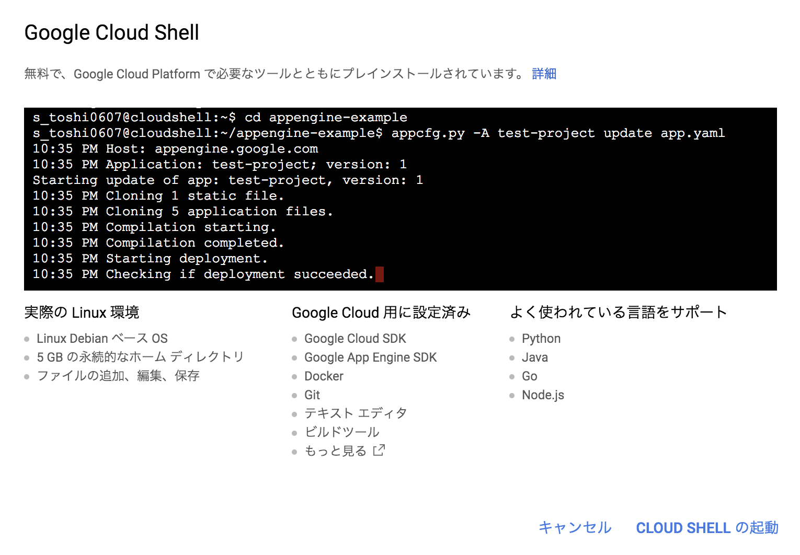
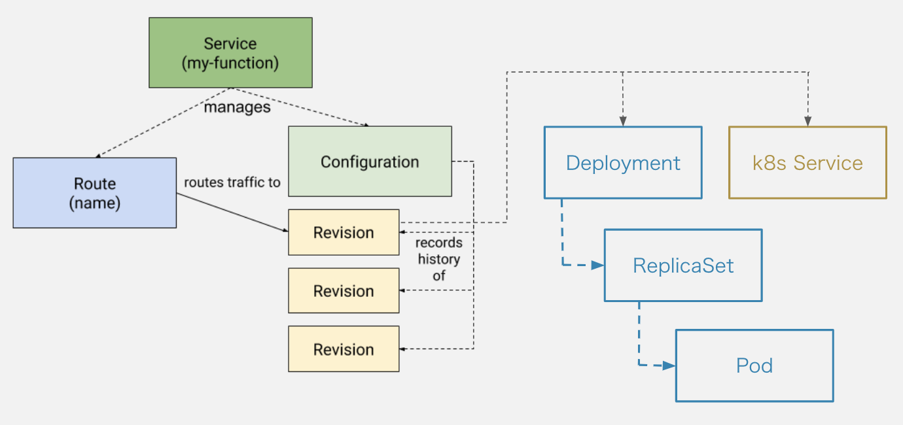
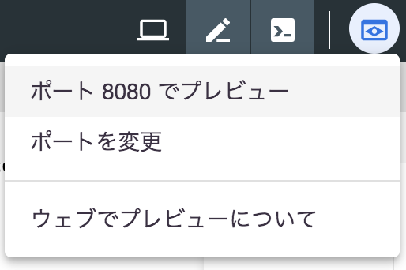
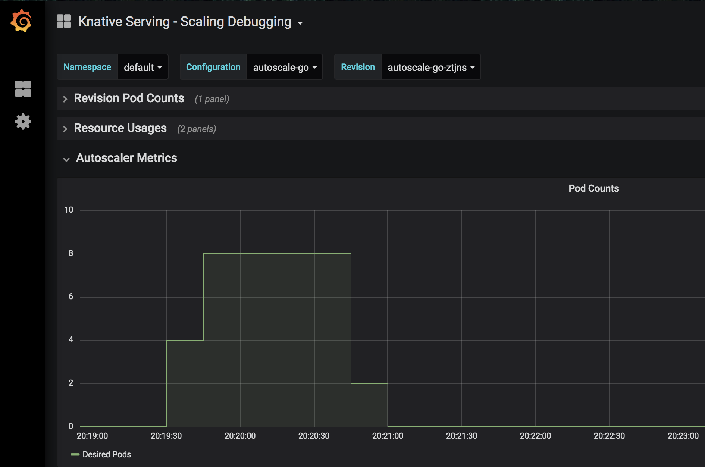

# build-your-own-platform-with-knative


## 環境構築

### Kubernetes

本ハンズオンは基本的にGCPを利用します。Google Cloud Shell上でコマンドを実行し、Google Kubernetes Engine（GKE）上にKubernetesクラスタを準備します。

ローカル環境のターミナルからローカル環境にKubernetesクラスタを構築することももちろん可能です。しかし、本ハンズオンでは準備を容易にし、Knativeを学ぶことに一層集中していただくためにCloud ShellとGKEの利用を推奨します。

つぎの環境を準備していきます。

* Google Cloud Platform（GCP）アカウント
* GCPプロジェクト
* Google Cloud Shell
* GKEプロジェクト
* Google Container Registry（GCR）
* Kubernetesクラスタ
* Knative
* Tekton

#### GCPアカウント

これまで一度もGCPを有料で利用したことがない方や無料トライアルに登録したことがない方は無料トライアルを利用することができます。次のURLで利用条件をご確認の上Googleアカウントでログインし、登録してください。身元確認用のクレジットカード番号か銀行口座情報が必要です。

https://cloud.google.com/free/docs/frequently-asked-questions?hl=ja

すでに登録済みのアカウントがある場合はそのアカウントをご利用ください。

#### GCPプロジェクト

GKEでKubernetesクラスタを構築するプロジェクトを作成します。本ハンズオン用に利用できるプロジェクトがすでにある場合はスキップして大丈夫です。

ダッシュボードで*作成*をクリックしてください。


新しいプロジェクトの任意のプロジェクト名を入力し、*作成*をクリックしてください。


この例ではknative-toshi0607という名前で作成します。

#### Google Cloud Shell

作成したプロジェクトを選択してください。


以後Cloud Shellで作業を進めます。

Cloud Shellをアクティブにしてください。


Cloud ShellではすでにGoogle Cloud SDKやDockerが準備されています。




*新しいウィンドウで開く*をクリックし、十分な作業スペースを確保してください。


#### Kubernetesクラスタ

まず利用する環境変数をセットしてください。

```shell
# 先ほど作成したGCPプロジェクトのID
export PROJECT_ID=knative-toshi0607
# なんでもいいです
export CLUSTER_NAME=knative
# 
export CLUSTER_ZONE=asia-northeast1-c
```

※ [選択できるリージョンとゾーン](https://cloud.google.com/compute/docs/regions-zones/#available)

つぎのコマンドを実行してGKEとGCRを有効化してください。

```shell
$ gcloud services enable \
  cloudapis.googleapis.com \
  container.googleapis.com \
  containerregistry.googleapis.com
```

つぎのコマンドを実行してKubernetesクラスタを作成してください。

```shell
$ gcloud beta container clusters create $CLUSTER_NAME \
  --addons=HorizontalPodAutoscaling,HttpLoadBalancing,Istio \
  --machine-type=n1-standard-4 \
  --cluster-version=latest --zone=$CLUSTER_ZONE \
  --enable-stackdriver-kubernetes --enable-ip-alias \
  --enable-autoscaling --min-nodes=1 --max-nodes=5 \
  --enable-autorepair \
  --scopes cloud-platform
```

つぎのコマンドを実行して現在のユーザーにcluster-adminロールを付与してください。

```shell
$ kubectl create clusterrolebinding cluster-admin-binding \
  --clusterrole=cluster-admin \
  --user=$(gcloud config get-value core/account)
```

作成には少し時間がかかります。つぎのURLから作成状況が確認できます。

https://console.cloud.google.com/kubernetes/list

つぎのコマンドを実行してノードの準備ができていることを確認してください。

```shell
$ kubectl get nodes
```

正常に作成が完了していれば3ノードのステータスが*Ready*になっているはずです。


#### Knative

つぎのコマンドを実行してKnativeをインストールしてください。似た別オプションのコマンドを2回実行するので注意してください。

```shell
$ kubectl apply --selector knative.dev/crd-install=true \
   --filename https://github.com/knative/serving/releases/download/v0.9.0/serving.yaml \
   --filename https://github.com/knative/eventing/releases/download/v0.9.0/release.yaml \
   --filename https://github.com/knative/serving/releases/download/v0.9.0/monitoring.yaml

$ kubectl apply --filename https://github.com/knative/serving/releases/download/v0.9.0/serving.yaml \
   --filename https://github.com/knative/eventing/releases/download/v0.9.0/release.yaml \
   --filename https://github.com/knative/serving/releases/download/v0.9.0/monitoring.yaml
```

つぎのコマンドを実行して確認ステータスを確認してください。すべてのPodのStatusが*Running*}*になれば設定完了です。

```shell
$ kubectl get pods --namespace knative-serving
$ kubectl get pods --namespace knative-eventing
$ kubectl get pods --namespace knative-monitoring
```

#### Tekton

つぎのコマンドを実行してTektonをインストールしてください。

```
$ kubectl apply --filename https://storage.googleapis.com/tekton-releases/latest/release.yaml
```

つぎのコマンドを実行して確認ステータスを確認してください。すべてのPodのStatusが*Running*}*になれば設定完了です。

```
$ kubectl get pods --namespace tekton-pipelines
```

以上で環境構築は終わりです。

## Serving

Servingの責務はオートスケールアップ・ダウン、トラフィックコントロール、バージョン管理などです。Servingは4つのコンポーネント（CRD）から構成されます。

 * Configuration: 最新の設定
 * Revision: コードと設定の履歴
 * Route: Revisionへのルーティング
 * Service: RouteとConfigurationから構成されるサービス全体

つぎの図をイメージしながら進めてください。


### Hello World

まずはTARGET環境変数にセットした文字を使ってHello worldするアプリケーションをKnativeのServiceとしてデプロイします。

Cloud Shellでワークスペースを作成し、つぎのマニフェストを`service.yaml`という名前で保存してください。

```
$ mkdir knative-workshop
$ cd knative-workshop
$ touch service.yaml
```

service.yaml
```yaml
apiVersion: serving.knative.dev/v1alpha1
kind: Service
metadata:
  name: helloworld
  namespace: default
spec:
  runLatest:
    configuration:
      revisionTemplate:
        spec:
          container:
            image: "gcr.io/knative-samples/helloworld-go"
            env:
            - name: "TARGET"
              value: "Knative serving"
```

つぎのコマンドでマニフェストを適用してください。

```
# マニフェストファイルの適用
$ kubectl apply -f service.yaml
service.serving.knative.dev/helloworld created

# KnativeのKubernetesオブジェクトの登録状況確認
$ kubectl get ksvc,configuration,route
```

各KubernetesオブジェクトのREADYがすべて`True`になったら準備完了です。

アプリケーションにアクセスしてみてください。

```
# IPアドレスの取得
$ export IP_ADDRESS=$(kubectl get svc istio-ingressgateway --namespace istio-system --output 'jsonpath={.status.loadBalancer.ingress[0].ip}')

# curlでリクエスト
$ curl -H "Host: helloworld.default.example.com" http://$IP_ADDRESS
Hello Knative serving!
```

KnativeのKubernetesオブジェクトだけでなく、組み込みのKubernetesオブジェクトも動いているのが確認できます。

```
$ kubectl get pod,replicaset,deployment,service
```

Service、Deployment、ReplicaSet、Podオブジェクトが作成されていることが確認できます。これらはRevisionが管理しているもので、Revision毎に作成されています。

また、Podはリクエストがないときには消えています。5分ほど経ってからまた同じコマンドで存在を確認してみてください。

つぎのような状態になっています。



確認ができたらいったん登録したKnativeのServiceを削除してください。

```
$ kubectl delete -f service.yaml
```

#### 参考

* 実行したアプリケーションのソースコード
  * [helloworld.go](https://github.com/knative/docs/blob/master/docs/serving/samples/hello-world/helloworld-go/helloworld.go)
* Knativeを利用せずに、Kubernetesの組み込みオブジェクトでknative Serviceを構築する場合との比較
  * [Migrating from Kubernetes Deployment to Knative Serving](https://medium.com/google-cloud/migrating-from-kubernetes-deployment-to-knative-serving-bdc45ef1bb9e)

### オートスケール

今度は負荷をかけながらPodがどのようにスケールするのかを確認します。

負荷をかけるのには[rakyll/hey](https://github.com/rakyll/hey)というツールを利用します。

つぎのコマンドでインストールしてください。

```shell
$ go get -u github.com/rakyll/hey
$ hey
Usage: hey [options...] <url>

Options:
  -n  Number of requests to run. Default is 200.
...
```

つぎのマニフェストを`autoscale-go.yaml`という名前で保存してください。

```yaml
apiVersion: serving.knative.dev/v1alpha1
kind: Service
metadata:
  name: autoscale-go
  namespace: default
spec:
  template:
    metadata:
      annotations:
        # KPA
        # Knative concurrency-based autoscaling (default).
        # autoscaling.knative.dev/class: kpa.autoscaling.knative.dev
        # autoscaling.knative.dev/metric: concurrency

        # Target 10 in-flight-requests per pod.
        autoscaling.knative.dev/target: "10"

        # HPA
        # Standard Kubernetes CPU-based autoscaling.
        # autoscaling.knative.dev/class: hpa.autoscaling.knative.dev
        # autoscaling.knative.dev/metric: cpu
    spec:
      containers:
      - image: gcr.io/knative-samples/autoscale-go:0.1

```

つぎのコマンドでマニフェストを適用してください。

```
# マニフェストファイルの適用
$ kubectl apply -f autoscale-go.yaml
service.serving.knative.dev/autoscale-go created

# KnativeのKubernetesオブジェクトの登録状況確認
$ kubectl get ksvc,configuration,route
```

heyコマンドを利用して負荷をかけてみてください。

```
# 30秒間50並列リクエスト
$ hey -z 30s -c 50 \
  -host "autoscale-go.default.example.com" \
  "http://${IP_ADDRESS?}?sleep=100&prime=10000&bloat=5" \
  && kubectl get pod
```

オートスケールの様子を[Grafana](https://grafana.com/)を使って確認してみましょう。

```
$ kubectl port-forward --namespace knative-monitoring $(kubectl get pods --namespace knative-monitoring --selector=app=grafana  --output=jsonpath="{.items..metadata.name}") 8080:3000
```

ダッシュボードはブラウザで確認できます。*ポート8080でプレビュー*を選択してください。



*Knarive Serving - Scaling Debuging*を選択するとオートスケールの様子が確認できます。



確認ができたらいったん登録したKnativeのServiceを削除してください。

```
$ kubectl delete -f autoscale-go.yaml
```

#### 参考

* 実行したアプリケーションのソースコード
  * [autoscale.go](https://github.com/knative/docs/blob/master/docs/serving/samples/autoscale-go/autoscale.go)
* [オートスケールの設定を変更する](https://github.com/knative/docs/blob/master/docs/serving/configuring-the-autoscaler.md)
* [負荷のかけ方を変更する](https://github.com/knative/docs/tree/master/docs/serving/samples/autoscale-go#other-experiments)
* [オートスケールの仕組み](https://github.com/knative/serving/blob/master/docs/scaling/DEVELOPMENT.md)

### トラフィック分割

Revisionに流すトラフィックの割合を変更してみましょう。ブルーグリーンデプロイメントなどを実現するための機能です。

この例ではあるRevision（blue）へのリクエストを徐々に別のRevision（green）に移行していきます。

つぎのマニフェストを`blue-green-config.yaml`という名前で保存してください。

```yaml
apiVersion: serving.knative.dev/v1alpha1
kind: Configuration
metadata:
  name: blue-green-demo
  namespace: default
spec:
  template:
    metadata:
      labels:
        knative.dev/type: container
    spec:
      containers:
        - image: gcr.io/knative-samples/helloworld-go
          env:
            - name: TARGET
              value: "blue"

```

マニフェストを適用して`Configuration`を作成してください。先ほどの例では`Service`を作成することで`Service`が管理する`Configuration`と`Route`を間接的に作成しましたが、この例ではそれぞれ個別に作成します。実行するアプリケーションはTARGET環境変数に*blue*をセットしたhelloworldです。

```shell
$ kubectl apply --filename blue-green-config.yaml
```

この`Configuration`登録を登録したときに作成された`Revision`にトラフィックを流すための`Route`を登録します。

まずつぎのコマンドでRevision名を取得してください。

```shell
$ kubectl get configurations blue-green-demo -o=jsonpath='{.status.latestCreatedRevisionName}'
blue-green-demo-66h62 # 人によって異なります。
```

つぎのマニフェストを`blue-green-route.yaml`という名前で保存してください。`spec.traffic[0].revisionName`は上で取得したもので置き換えが必要です。

```yaml
apiVersion: serving.knative.dev/v1alpha1
kind: Route
metadata:
  name: blue-green-demo
  namespace: default
spec:
  traffic:
    - revisionName: blue-green-demo-66h62 # 取得したRevision名に置き換える
      percent: 100

```

アクセスしてみると、何度リクエストしても`Hello blue!`が出力されすはずです。

```
$ curl -H "Host: blue-green-demo.default.example.com" http://${IP_ADDRESS}
Hello blue!
```

新しい`Revision`を作成してトラフィックをそちらに移行し始めましょう。`Configuration`のTARGET環境変数を`green`に変更し、適用してください。

変更後のblue-green-config.yamlはこちらです。

```yaml
apiVersion: serving.knative.dev/v1alpha1
kind: Configuration
metadata:
  name: blue-green-demo
  namespace: default
spec:
  template:
    metadata:
      labels:
        knative.dev/type: container
    spec:
      containers:
        - image: gcr.io/knative-samples/helloworld-go
          env:
            - name: TARGET
              value: "green" # blueからgreenに変更

```

変更後に適用してください。`Configuration`を更新するとRevisionが新たに作成されます。

```shell
$ kubectl apply --filename blue-green-config.yaml
```

新しく作成された`Revison`の名前を取得してください。

```shell
$ kubectl get configurations blue-green-demo -o=jsonpath='{.status.latestCreatedRevisionName}'
blue-green-demo-zdjbc # 人によって異なります。
```

新しく作成したRevisionへアクセスできるようにしてみましょう。

`blue-green-route.yaml`をつぎのように変更して保存してください。

```yaml
apiVersion: serving.knative.dev/v1alpha1
kind: Route
metadata:
  name: blue-green-demo
  namespace: default
spec:
  traffic:
    - revisionName: blue-green-demo-66h62 # blue
      percent: 100
    - revisionName: blue-green-demo-zdjbc # 新しく作成したRevision名、green
      percent: 0
      tag: v2
```

現在はまだ先に作ったgreenに100%のトラフィックが流れている状態です。

```
$ curl -H "Host: blue-green-demo.default.example.com" http://${IP_ADDRESS}
Hello blue!
```

しかし、tagをつけたことでテスト用のエンドポイントが払い出され、動作確認できるようになりました。

```
$ curl -H "Host: v2-blue-green-demo.default.example.com" http://${IP_ADDRESS}
Hello green!
```

テストが済んだらトラフィックを半分新しいRevisionに流してみましょう。

`blue-green-route.yaml`をつぎのように変更して保存してください。

```yaml
apiVersion: serving.knative.dev/v1alpha1
kind: Route
metadata:
  name: blue-green-demo
  namespace: default
spec:
  traffic:
    - revisionName: blue-green-demo-66h62 # blue
      percent: 50
    - revisionName: blue-green-demo-zdjbc # green
      percent: 50
      tag: v2
```

変更後に適用してください。

```
kubectl apply --filename blue-green-route.yaml
```

greenとblueに50%ずつトラフィックが流れます。何度かアクセスして確認してみてください。

```
$ curl -H "Host: blue-green-demo.default.example.com" http://${IP_ADDRESS}
Hello blue!
```

最終的にはgreenの`Revision`へのpercentを100、blueの`Revision`へのpercentを0にしてtag: v1をつけたらトラフィックの移行は完了です。

確認ができたらいったん登録したKnativeのConfiguration、Routeを削除してください。

```shell
$ kubectl delete --filename blue-green-config.yaml
$ kubectl delete --filename blue-green-route.yaml
```

#### 参考

* [Istioのトラフィック管理](https://istio.io/docs/concepts/traffic-management/)
