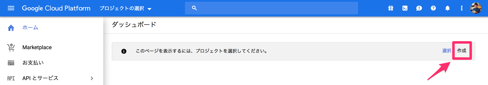
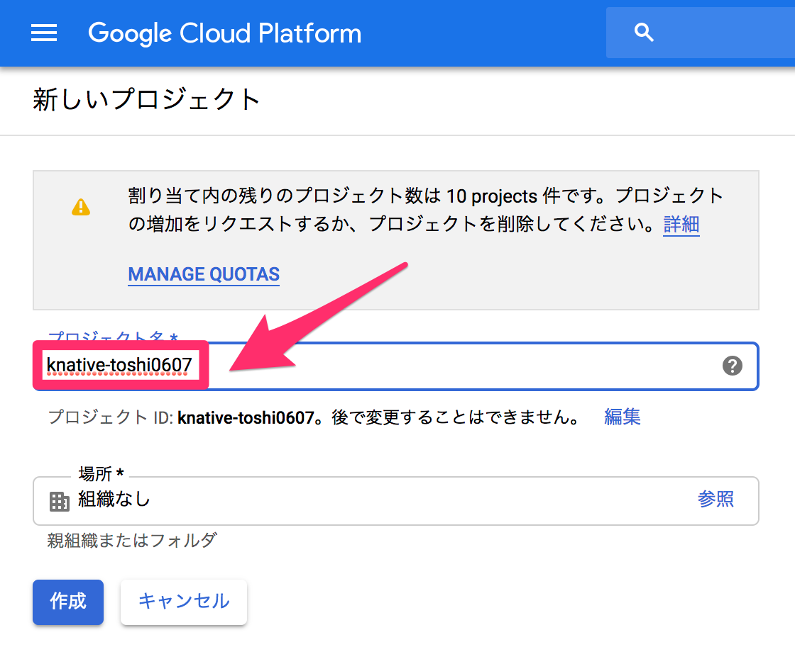
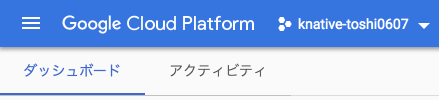
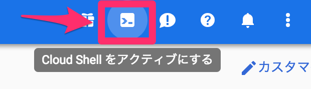
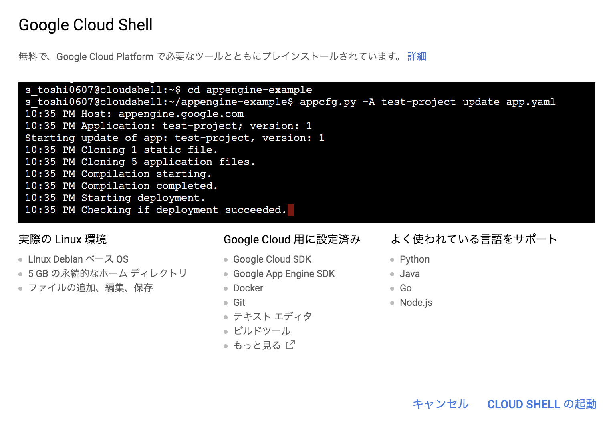
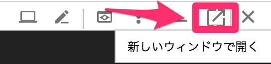

# 環境構築

## Kubernetes

本ワークショップでは基本的にGCPを利用します。Google Cloud Shell上でコマンドを実行し、Google Kubernetes Engine（GKE）上にKubernetesクラスタを準備します。

ローカル環境のターミナルからローカル環境にKubernetesクラスタを構築することももちろん可能です。しかし、本ワークショップでは準備を容易にし、Knativeを学ぶことに一層集中していただくためにCloud ShellとGKEの利用を推奨します。

つぎの環境を準備していきます。

* Google Cloud Platform（GCP）アカウント
* GCPプロジェクト
* Google Cloud Shell
* GKEプロジェクト
* Google Container Registry（GCR）
* Kubernetesクラスタ
* Knative
* Tekton

### GCPアカウント

これまで一度もGCPを有料で利用したことがない方や無料トライアルに登録したことがない方は無料トライアルを利用することができます。次のURLで利用条件をご確認の上Googleアカウントでログインし、登録してください。身元確認用のクレジットカード番号か銀行口座情報が必要です。

https://cloud.google.com/free/docs/frequently-asked-questions?hl=ja

すでに登録済みのアカウントがある場合はそのアカウントをご利用ください。

### GCPプロジェクト

GKEでKubernetesクラスタを構築するプロジェクトを作成します。本ワークショップ用に利用できるプロジェクトがすでにある場合はスキップして大丈夫です。

ダッシュボードで*作成*をクリックしてください。



新しいプロジェクトの任意のプロジェクト名を入力し、*作成*をクリックしてください。



この例ではknative-toshi0607という名前で作成します。

### Google Cloud Shell

作成したプロジェクトを選択してください。



以後Cloud Shellで作業を進めます。

Cloud Shellをアクティブにしてください。



Cloud ShellではすでにGoogle Cloud SDKやDockerが準備されています。




*新しいウィンドウで開く*をクリックし、十分な作業スペースを確保してください。




### Kubernetesクラスタ

まず利用する環境変数をセットしてください。

```shell
# 先ほど作成したGCPプロジェクトのID
export PROJECT_ID=knative-toshi0607
# なんでもいいです
export CLUSTER_NAME=knative
# 
export CLUSTER_ZONE=asia-northeast1-c
```

※ [選択できるリージョンとゾーン](https://cloud.google.com/compute/docs/regions-zones/#available)

つぎのコマンドを実行してデフォルトのGCPプロジェクトIDをセットしてください。

```shell
$ gcloud config set project $PROJECT_ID
```


つぎのコマンドを実行してGKEとGCRを有効化してください。

```shell
$ gcloud services enable \
  cloudapis.googleapis.com \
  container.googleapis.com \
  containerregistry.googleapis.com
```

つぎのコマンドを実行してKubernetesクラスタを作成してください。

```shell
$ gcloud beta container clusters create $CLUSTER_NAME \
  --addons=HorizontalPodAutoscaling,HttpLoadBalancing,Istio \
  --machine-type=n1-standard-2 \
  --cluster-version=latest --zone=$CLUSTER_ZONE \
  --enable-stackdriver-kubernetes --enable-ip-alias \
  --enable-autoscaling --min-nodes=1 --max-nodes=5 \
  --enable-autorepair \
  --scopes cloud-platform
```

作成には少し時間がかかります。つぎのURLから作成状況が確認できます。

https://console.cloud.google.com/kubernetes/list

つぎのコマンドを実行して現在のユーザーにcluster-adminロールを付与してください。

```shell
$ kubectl create clusterrolebinding cluster-admin-binding \
  --clusterrole=cluster-admin \
  --user=$(gcloud config get-value core/account)
```

つぎのコマンドを実行してノードの準備ができていることを確認してください。

```shell
$ kubectl get nodes
```

正常に作成が完了していれば3ノードのステータスが*Ready*になっているはずです。


### Knative

つぎのコマンドを実行してKnativeをインストールしてください。似た別オプションのコマンドを2回実行するので注意してください。

```shell
$ kubectl apply --selector knative.dev/crd-install=true \
   --filename https://github.com/knative/serving/releases/download/v0.10.0/serving.yaml \
   --filename https://github.com/knative/eventing/releases/download/v0.10.0/release.yaml \
   --filename https://github.com/knative/serving/releases/download/v0.10.0/monitoring.yaml

$ kubectl apply --filename https://github.com/knative/serving/releases/download/v0.10.0/serving.yaml \
   --filename https://github.com/knative/eventing/releases/download/v0.10.0/release.yaml \
   --filename https://github.com/knative/serving/releases/download/v0.10.0/monitoring.yaml
```

つぎのコマンドを実行して確認ステータスを確認してください。すべてのPodのStatusが*Running*になれば設定完了です。

```shell
$ kubectl get pods --namespace knative-serving
$ kubectl get pods --namespace knative-eventing
$ kubectl get pods --namespace knative-monitoring
```

EventingでKnativeのServiceをsinkに指定する場合は現状追加でセットアップが必要です。本ワークショップをEventing含めて実施する場合はつぎのコマンドを実行してください。

```
$ kubectl apply -f https://raw.githubusercontent.com/knative/serving/release-0.10/third_party/istio-1.2.7/istio-knative-extras.yaml

# Istioのバージョン確認
# $ kubectl get pod -n istio-system
# istio-ingressgateway-f659695c4-sssrs
# $ kubectl get pod istio-ingressgateway-f659695c4-sssrs -n istio-system -oyaml | grep image
# image: gke.gcr.io/istio/proxyv2:1.1.16-gke.0
# => OK: 1.2.7, NG: 1.3.3
```

cf. [issue#1973](https://github.com/knative/eventing/issues/1973)

### Tekton

つぎのコマンドを実行してTektonをインストールしてください。

```
$ kubectl apply --filename https://storage.googleapis.com/tekton-releases/latest/release.yaml
```

つぎのコマンドを実行して確認ステータスを確認してください。すべてのPodのStatusが*Running*}*になれば設定完了です。

```
$ kubectl get pods --namespace tekton-pipelines
```

以上で環境構築は終わりです。

[戻る](README.md) | [次へ](step1.md)
