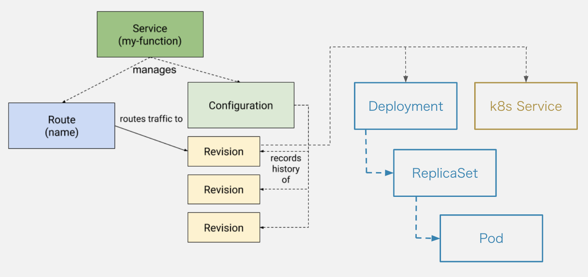
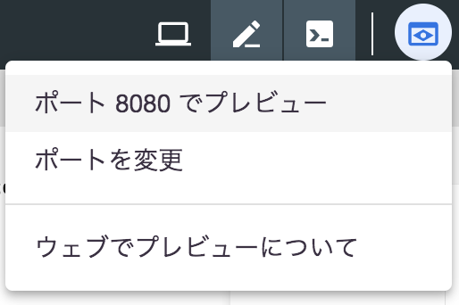
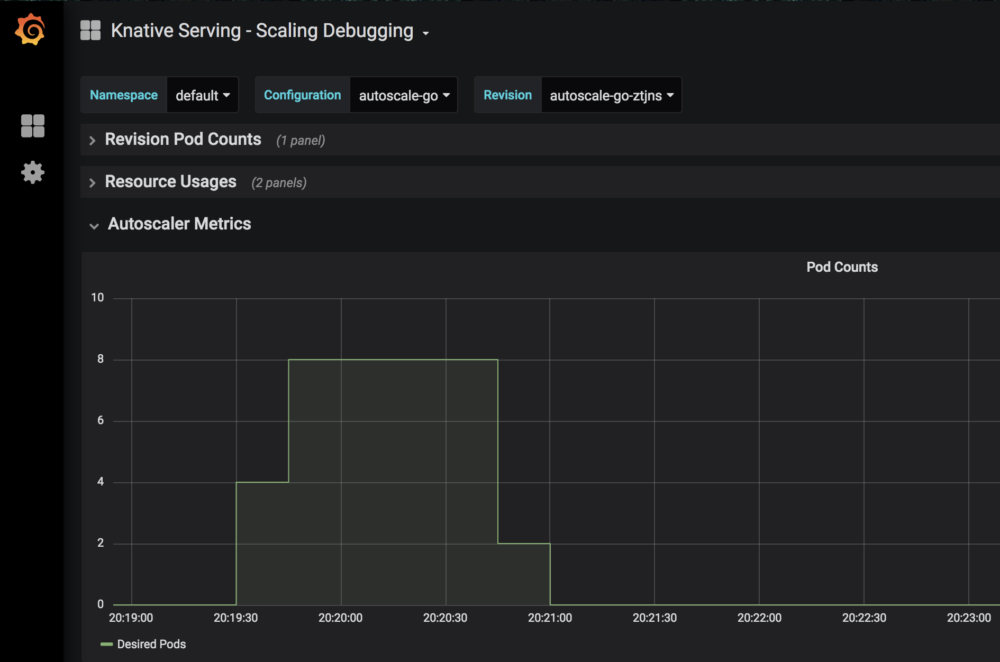

# Serving

Servingの責務はオートスケールアップ・ダウン、トラフィックコントロール、バージョン管理などです。Servingは4つのコンポーネントから構成されます。

 * Configuration: 最新の設定
 * Revision: コードと設定の履歴
 * Route: Revisionへのルーティング
 * Service: RouteとConfigurationから構成されるサービス全体

つぎの図をイメージしながら進めてください。


## Hello World

まずはTARGET環境変数にセットした文字を使ってHello worldするアプリケーションをKnativeのServiceとしてデプロイします。

Cloud Shellでワークスペースを作成し、つぎのマニフェストを`service.yaml`という名前で保存してください。

```
$ mkdir knative-workshop
$ cd knative-workshop
$ touch service.yaml
```

service.yaml
```yaml
apiVersion: serving.knative.dev/v1alpha1
kind: Service
metadata:
  name: helloworld
  namespace: default
spec:
  runLatest:
    configuration:
      revisionTemplate:
        spec:
          container:
            image: "gcr.io/knative-samples/helloworld-go"
            env:
            - name: "TARGET"
              value: "Knative serving"
```

つぎのコマンドでマニフェストを適用してください。

```
# マニフェストファイルの適用
$ kubectl apply -f service.yaml
service.serving.knative.dev/helloworld created

# KnativeのKubernetesオブジェクトの登録状況確認
$ kubectl get ksvc,configuration,route
```

各KubernetesオブジェクトのREADYがすべて`True`になったら準備完了です。

アプリケーションにアクセスしてみてください。

```
# IPアドレスの取得
$ export IP_ADDRESS=$(kubectl get svc istio-ingressgateway --namespace istio-system --output 'jsonpath={.status.loadBalancer.ingress[0].ip}')

# curlでリクエスト
$ curl -H "Host: helloworld.default.example.com" http://$IP_ADDRESS
Hello Knative serving!
```

KnativeのKubernetesオブジェクトだけでなく、組み込みのKubernetesオブジェクトも動いているのが確認できます。

```
$ kubectl get pod,replicaset,deployment,service
```

Service、Deployment、ReplicaSet、Podオブジェクトが作成されていることが確認できます。これらはRevisionが管理しているもので、Revision毎に作成されています。

また、Podはリクエストがないときには消えています。5分ほど経ってからまた同じコマンドで存在を確認してみてください。

つぎのような状態になっています。



確認ができたらいったん登録したKnativeのServiceを削除してください。

```
$ kubectl delete -f service.yaml
```

### 参考

* 実行したアプリケーションのソースコード
  * [helloworld.go](https://github.com/knative/docs/blob/master/docs/serving/samples/hello-world/helloworld-go/helloworld.go)
* Knativeを利用せずに、Kubernetesの組み込みオブジェクトでknative Serviceを構築する場合との比較
  * [Migrating from Kubernetes Deployment to Knative Serving](https://medium.com/google-cloud/migrating-from-kubernetes-deployment-to-knative-serving-bdc45ef1bb9e)

## オートスケール

今度は負荷をかけながらPodがどのようにスケールするのかを確認します。

負荷をかけるのには[rakyll/hey](https://github.com/rakyll/hey)というツールを利用します。

つぎのコマンドでインストールしてください。

```shell
$ go get -u github.com/rakyll/hey
$ hey
Usage: hey [options...] <url>

Options:
  -n  Number of requests to run. Default is 200.
...
```

つぎのマニフェストを`autoscale-go.yaml`という名前で保存してください。

```yaml
apiVersion: serving.knative.dev/v1alpha1
kind: Service
metadata:
  name: autoscale-go
  namespace: default
spec:
  template:
    metadata:
      annotations:
        # KPA
        # Knative concurrency-based autoscaling (default).
        # autoscaling.knative.dev/class: kpa.autoscaling.knative.dev
        # autoscaling.knative.dev/metric: concurrency

        # Target 10 in-flight-requests per pod.
        autoscaling.knative.dev/target: "10"

        # HPA
        # Standard Kubernetes CPU-based autoscaling.
        # autoscaling.knative.dev/class: hpa.autoscaling.knative.dev
        # autoscaling.knative.dev/metric: cpu
    spec:
      containers:
      - image: gcr.io/knative-samples/autoscale-go:0.1

```

つぎのコマンドでマニフェストを適用してください。

```
# マニフェストファイルの適用
$ kubectl apply -f autoscale-go.yaml
service.serving.knative.dev/autoscale-go created

# KnativeのKubernetesオブジェクトの登録状況確認
$ kubectl get ksvc,configuration,route
```

heyコマンドを利用して負荷をかけてみてください。

```
# 30秒間50並列リクエスト
$ hey -z 30s -c 50 \
  -host "autoscale-go.default.example.com" \
  "http://${IP_ADDRESS?}?sleep=100&prime=10000&bloat=5" \
  && kubectl get pod
```

オートスケールの様子を[Grafana](https://grafana.com/)を使って確認してみましょう。

```
$ kubectl port-forward --namespace knative-monitoring $(kubectl get pods --namespace knative-monitoring --selector=app=grafana  --output=jsonpath="{.items..metadata.name}") 8080:3000
```

ダッシュボードはブラウザで確認できます。*ポート8080でプレビュー*を選択してください。



*Knarive Serving - Scaling Debuging*を選択するとオートスケールの様子が確認できます。



確認ができたらいったん登録したKnativeのServiceを削除してください。

```
$ kubectl delete -f autoscale-go.yaml
```

### 参考

* 実行したアプリケーションのソースコード
  * [autoscale.go](https://github.com/knative/docs/blob/master/docs/serving/samples/autoscale-go/autoscale.go)
* [オートスケールの設定を変更する](https://github.com/knative/docs/blob/master/docs/serving/configuring-the-autoscaler.md)
* [負荷のかけ方を変更する](https://github.com/knative/docs/tree/master/docs/serving/samples/autoscale-go#other-experiments)
* [オートスケールの仕組み](https://github.com/knative/serving/blob/master/docs/scaling/DEVELOPMENT.md)

## トラフィック分割

Revisionに流すトラフィックの割合を変更してみましょう。ブルーグリーンデプロイメントなどを実現するための機能です。

この例ではあるRevision（blue）へのリクエストを徐々に別のRevision（green）に移行していきます。

つぎのマニフェストを`blue-green-config.yaml`という名前で保存してください。

```yaml
apiVersion: serving.knative.dev/v1alpha1
kind: Configuration
metadata:
  name: blue-green-demo
  namespace: default
spec:
  template:
    metadata:
      labels:
        knative.dev/type: container
    spec:
      containers:
        - image: gcr.io/knative-samples/helloworld-go
          env:
            - name: TARGET
              value: "blue"

```

マニフェストを適用して`Configuration`を作成してください。先ほどの例では`Service`を作成することで`Service`が管理する`Configuration`と`Route`を間接的に作成しましたが、この例ではそれぞれ個別に作成します。実行するアプリケーションはTARGET環境変数に*blue*をセットしたhelloworldです。

```shell
$ kubectl apply --filename blue-green-config.yaml
```

この`Configuration`登録を登録したときに作成された`Revision`にトラフィックを流すための`Route`を登録します。

まずつぎのコマンドでRevision名を取得してください。

```shell
$ kubectl get configurations blue-green-demo -o=jsonpath='{.status.latestCreatedRevisionName}'
blue-green-demo-66h62 # 人によって異なります。
```

つぎのマニフェストを`blue-green-route.yaml`という名前で保存してください。`spec.traffic[0].revisionName`は上で取得したもので置き換えが必要です。

```yaml
apiVersion: serving.knative.dev/v1alpha1
kind: Route
metadata:
  name: blue-green-demo
  namespace: default
spec:
  traffic:
    - revisionName: blue-green-demo-66h62 # 取得したRevision名に置き換える
      percent: 100

```

アクセスしてみると、何度リクエストしても`Hello blue!`が出力されすはずです。

```
$ curl -H "Host: blue-green-demo.default.example.com" http://${IP_ADDRESS}
Hello blue!
```

新しい`Revision`を作成してトラフィックをそちらに移行し始めましょう。`Configuration`のTARGET環境変数を`green`に変更し、適用してください。

変更後のblue-green-config.yamlはこちらです。

```yaml
apiVersion: serving.knative.dev/v1alpha1
kind: Configuration
metadata:
  name: blue-green-demo
  namespace: default
spec:
  template:
    metadata:
      labels:
        knative.dev/type: container
    spec:
      containers:
        - image: gcr.io/knative-samples/helloworld-go
          env:
            - name: TARGET
              value: "green" # blueからgreenに変更

```

変更後に適用してください。`Configuration`を更新するとRevisionが新たに作成されます。

```shell
$ kubectl apply --filename blue-green-config.yaml
```

新しく作成された`Revison`の名前を取得してください。

```shell
$ kubectl get configurations blue-green-demo -o=jsonpath='{.status.latestCreatedRevisionName}'
blue-green-demo-zdjbc # 人によって異なります。
```

新しく作成したRevisionへアクセスできるようにしてみましょう。

`blue-green-route.yaml`をつぎのように変更して保存してください。

```yaml
apiVersion: serving.knative.dev/v1alpha1
kind: Route
metadata:
  name: blue-green-demo
  namespace: default
spec:
  traffic:
    - revisionName: blue-green-demo-66h62 # blue
      percent: 100
    - revisionName: blue-green-demo-zdjbc # 新しく作成したRevision名、green
      percent: 0
      tag: v2
```

現在はまだ先に作ったgreenに100%のトラフィックが流れている状態です。

```
$ curl -H "Host: blue-green-demo.default.example.com" http://${IP_ADDRESS}
Hello blue!
```

しかし、tagをつけたことでテスト用のエンドポイントが払い出され、動作確認できるようになりました。

```
$ curl -H "Host: v2-blue-green-demo.default.example.com" http://${IP_ADDRESS}
Hello green!
```

テストが済んだらトラフィックを半分新しいRevisionに流してみましょう。

`blue-green-route.yaml`をつぎのように変更して保存してください。

```yaml
apiVersion: serving.knative.dev/v1alpha1
kind: Route
metadata:
  name: blue-green-demo
  namespace: default
spec:
  traffic:
    - revisionName: blue-green-demo-66h62 # blue
      percent: 50
    - revisionName: blue-green-demo-zdjbc # green
      percent: 50
      tag: v2
```

変更後に適用してください。

```
$ kubectl apply --filename blue-green-route.yaml
```

greenとblueに50%ずつトラフィックが流れます。何度かアクセスして確認してみてください。

```
$ curl -H "Host: blue-green-demo.default.example.com" http://${IP_ADDRESS}
Hello blue!
```

最終的にはgreenの`Revision`へのpercentを100、blueの`Revision`へのpercentを0にしてtag: v1をつけたらトラフィックの移行は完了です。

確認ができたらいったん登録したKnativeのConfiguration、Routeを削除してください。

```shell
$ kubectl delete --filename blue-green-config.yaml
$ kubectl delete --filename blue-green-route.yaml
```

### 参考

* [Istioのトラフィック管理](https://istio.io/docs/concepts/traffic-management/)

# Eventing

Eventingの責務はイベントのバインディングとデリバリーです。つぎのコンポーネント（CRD）を通じてイベントドリブンなアーキテクチャを実現します。

* Souces: イベントソース。「Souces」という名前のCRDがあるのではなく、種類ごとに独立したCRDになっている。
* Broker: イベントを受け取り、フィルタリングされたものをService（subscriber）に渡す
* Trigger: subscriberにわたすイベントのフィルター

つぎの図をイメージしながら進めてください。

***********
図を足す
***********

## Hello World

最初はイベントソースを`CronJobSource`とするシンプルな例を見てみましょう。`CronJobSource`で発生したイベントはKnativeの`Service`で受け取ります。

まず、イベントを受け取る`Service`を準備します。つぎのマニフェストを`event-display-service.yaml`という名前で保存してください。

```yaml
apiVersion: serving.knative.dev/v1alpha1
kind: Service
metadata:
  name: event-display
spec:
  template:
    spec:
      containers:
        - image: gcr.io/knative-releases/github.com/knative/eventing-sources/cmd/event_display

```

つぎのコマンドでマニフェストを適用してください。

```shell
$ kubectl apply --filename event-display-service.yaml
```

今度は`CronJobSource`を準備します。つぎのマニフェストを`cronjob-source.yaml`という名前で保存してください。

```yaml
apiVersion: sources.eventing.knative.dev/v1alpha1
kind: CronJobSource
metadata:
  name: cronjob-source
spec:
  schedule: "*/1 * * * *"
  data: '{"message": "Hello Eventing!"}'
  sink:
    apiVersion: serving.knative.dev/v1alpha1
    kind: Service
    name: event-display
```

つぎのコマンドでマニフェストを適用してください。

```shell
$ kubectl apply --filename cronjob-source.yaml
```

`CronJobSource`はspec.scheduleに記述したクロン式に従ってイベントを発行します。この例では1分毎にHello Eventing!というメッセージを発行します。

KnativeのServiceで受信したメッセージはコンテナのログで確認できます。つぎのコマンドを実行してメッセージを確認してください。

```shell
$ kubectl logs -l serving.knative.dev/service=event-display -c user-container
```

確認ができたらいったん登録した`Service`、`CronJobSource`を削除してください。

```shell
$ kubectl delete --filename event-display-service.yaml
$ kubectl delete --filename cronjob-source.yaml
```

### 参考

* 実行したアプリケーションのソースコード
  * [event_display](https://github.com/knative/eventing-contrib/blob/master/cmd/event_display/main.go)
* Eventing v0.9でKnative Servingを利用するにあたりcluster local gatewayを別途セットアップしなければならない件
  * [Cluster local issue with Knative Eventing v0.9.0](https://medium.com/google-cloud/cluster-local-issue-with-knative-eventing-v0-9-0-a1fee2215cfe)
  * https://github.com/knative/eventing/issues/1973

## PubSub

今度はCloud PubSubのイベントを処理してみましょう。

まずGCP Cloud Pub/Subをイベントソースとするためにつぎのコマンドを実行してください。

```shell
$ kubectl apply -f https://github.com/google/knative-gcp/releases/download/v0.9.0/cloud-run-events.yaml
```

利用しているGCPプロジェクトでCloud Pub/Sub APIを有効化してください。

```shell
$ gcloud services enable pubsub.googleapis.com
```

GCPのサービスアカウントを準備します。つぎのコマンドを実行して新しくサービスアカウントを作成してください。

```shell
$ gcloud iam service-accounts create cloudrunevents-pullsub
Created service account [cloudrunevents-pullsub]
```

作成したサービスアカウントにPub/Sub Editorロールを付与してください。

```shell
$ gcloud projects add-iam-policy-binding $PROJECT_ID \
  --member=serviceAccount:cloudrunevents-pullsub@$PROJECT_ID.iam.gserviceaccount.com \
  --role roles/pubsub.editor
```

サービスアカウントの秘密鍵をJSON形式でダウンロードしてください。

```shell
$ gcloud iam service-accounts keys create cloudrunevents-pullsub.json \
--iam-account=cloudrunevents-pullsub@$PROJECT_ID.iam.gserviceaccount.com
```

JSONファイルからKubernetesの`Secret`オブジェクトを作成してください。

```shell
$ kubectl --namespace default create secret generic google-cloud-key --from-file=key.json=cloudrunevents-pullsub.json
```

`Secret`はgoogle-cloud-keyという名前で参照します。

```shell
$ kubectl get secret
```

PubSubのトピックを作成してください。

```shell
$ export TOPIC_NAME=testing
$ gcloud pubsub topics create $TOPIC_NAME
```

イベントを処理する`Service`を作成してください。CronJobの例と同じくevent-display-serviceです。

```shell
$ kubectl apply --filename event-display-service.yaml
```

つぎのマニフェストを`pullsubscription.yaml`という名前で保存し、適用してください。specにはPubSubのtopic名とイベントの送信先を記述しています。

```yaml
apiVersion: pubsub.cloud.run/v1alpha1
kind: PullSubscription
metadata:
  name: testing-source-event-display
spec:
  topic: testing
  sink:
    apiVersion: serving.knative.dev/v1alpha1
    kind: Service
    name: event-display
```

```shell
$ kubectl apply -f pullsubscription.yaml
```

PubSubのトピックにイベントを発行してください。メッセージはなんでも大丈夫です。

```
$ gcloud pubsub topics publish testing --message="Hello PubSub"
```

KnativeのServiceで受信したメッセージはコンテナのログで確認できます。つぎのコマンドを実行してメッセージを確認してください。

```shell
$ kubectl logs -l serving.knative.dev/service=event-display -c user-container
```

確認ができたらいったん登録した`Service`、`PullSubscription`を削除してください。

```shell
$ kubectl delete --filename event-display-service.yaml
$ kubectl delete --filename pullsubscription.yaml
```

### 参考

* [Eventingのその他のサンプル](https://github.com/knative/docs/tree/master/docs/eventing/samples)
  * `Broker`や`Trigger`を利用するサンプルもあります
* [利用できるイベントソース](https://github.com/knative/docs/blob/master/docs/eventing/sources/README.md)
* [cloudeventsとは](https://github.com/cloudevents/spec/blob/master/spec.md#design-goals)

# Tekton

Tektonの責務はKubernetes上で　CI/CDパイプラインを構築、実行することです。KnativeのBuildコンポーネントを強化する形で始まりましたが、Buildはv0.7を最後に開発が終了しTektonに引き継がれました。

* Task: 「コンテナイメージをビルドする」「Kubernetes上にデプロイする」などの粒度のタスクを表現したオブジェクトです。タスクは1つ以上のstepから構成され、それぞれがコンテナで実行されます。自分で書くことも、[すでに準備されたもの](https://github.com/tektoncd/catalog)を選んで利用することもできます。
* TaskRun: Taskを実行するオブジェクトです。Taskがテンプレートとすると、それに具体的な値を与える実体です。
* PipelineResource: タスクで利用する入出力です。
* Pipeline: Taskを構成要素とするCI/CDパイプライン全体を表現するオブジェクトです。
* PipelineRun: Pipelineを実行するオブジェクトです。Pipelineがテンプレートとすると、それに具体的な値を与える実体です。TaskRunを作成してここのTaskを実行していきます。

つぎの図をイメージしながら進めてください。

## Hello World

[kaniko](https://github.com/GoogleContainerTools/kaniko)を利用した`Task`を使ってコンテナイメージをビルドしてレジストリにプッシュしてみましょう。

まず、kaniko `Task`を利用できるようにするためにつぎのコマンドを実行してください。

```
$ kubectl apply -f https://raw.githubusercontent.com/tektoncd/catalog/master/kaniko/kaniko.yaml
```

kaniko `Task`するにあたっては`TaskRun`で2つのパラメタを設定する必要があります。

* DOCKERFILE: Dockerfileへのパスです。デフォルトは`./Dockerfile`
* CONTEXT: Dockerの[ビルドコンテキスト](https://docs.docker.com/engine/reference/commandline/build/)です。デフォルトは`./`

ビルドの対象とするアプリケーションはhelloworld-goです。knative/docsリポジトリにソースコードがあるのでこれをビルドし、今利用しているGCPプロジェクトのGCRにプッシュします。

GCRのパスをご自身のGCPプロジェクトのPROJECT_IDに変更し、`taskrun-build-kaniko-helloworld-gcr.yaml`というファイル名で保存し、適用してください。

```yaml
apiVersion: tekton.dev/v1alpha1
kind: TaskRun
metadata:
  name: build-kaniko-helloworld-gcr
spec:
  taskRef:
    name: kaniko
  inputs:
    resources:
    - name: source
      resourceSpec:
        type: git
        params:
        - name: url
          value: https://github.com/knative/docs
    params:
    - name: DOCKERFILE
      value: Dockerfile
    - name: CONTEXT
      value: docs/serving/samples/hello-world/helloworld-go/
  outputs:
    resources:
    - name: image
      resourceSpec:
        type: image
        params:
        - name: url
          # ご自身のGCPプロジェクトIDに置き換えてください
          value: gcr.io/<your-project-id>/helloworld-go:latest
```

```shell
$ kubectl apply -f taskrun-build-kaniko-helloworld-gcr.yaml
```

つぎのコマンドを実行してビルド&プッシュを見守ってください。

```shell
$ kubectl get po -w
build-kaniko-helloworld-gcr-pod-e686b3   0/4     Init:3/4          0    5s
build-kaniko-helloworld-gcr-pod-e686b3   0/4     PodInitializing   0    6s
build-kaniko-helloworld-gcr-pod-e686b3   4/4     Running           0    8s
build-kaniko-helloworld-gcr-pod-e686b3   4/4     Running           0    8s
build-kaniko-helloworld-gcr-pod-e686b3   3/4     Running           0    11s
build-kaniko-helloworld-gcr-pod-e686b3   2/4     Running           0    16s
build-kaniko-helloworld-gcr-pod-e686b3   0/4     Completed         0    78s
```

つぎのコマンドを実行してGCRにイメージがプッシュされているか確認してください。

```shell
$ gcloud container images list-tags gcr.io/$PROJECT_ID/helloworld-go
```

`kubectl logs build-kaniko-helloworld-gcr-pod-e686b3`を実行するとPodで複数のコンテナが動いていることが確認できます。`-c`オプションでそれぞれのコンテナを指定するとコンテナのログも確認できます。

確認ができたらいったん登録した`Task`、`TaskRun`を削除してください。

```shell
$ kubectl delete -f taskrun-build-kaniko-helloworld-gcr.yaml
$ kubectl delete -f https://raw.githubusercontent.com/tektoncd/catalog/master/kaniko/kaniko.yaml
```

### 参考

* [kaniko Taskのマニフェスト](https://github.com/tektoncd/catalog/blob/master/kaniko/kaniko.yaml)
* [Tekton Catalog](https://github.com/tektoncd/catalog)にはすでにたくさんのカタログが用意されています。
  * アプリケーションのリント、テスト、ビルド
  * コンテナイメージのビルド
  * Kubenetesやクラウドとやりとりするためのコマンド
* [Pipelineを含むサンプル](https://github.com/tektoncd/pipeline/blob/master/docs/tutorial.md#pipeline)

[戻る](step0.md) | [次へ](step2.md)
