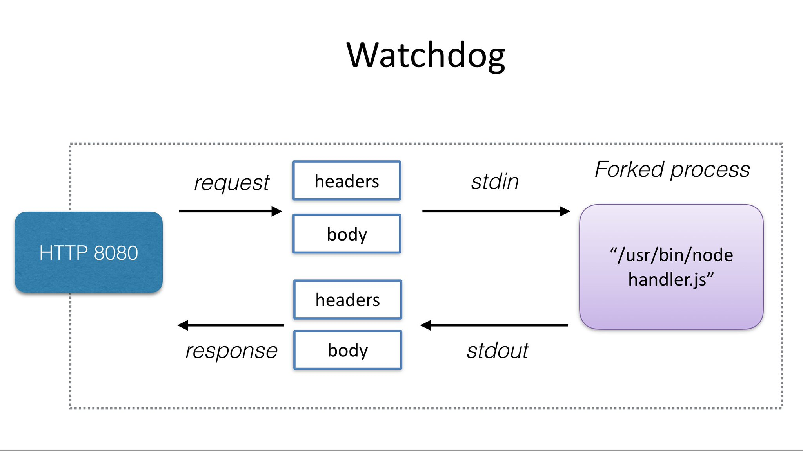

# FaaS Platform

いよいよ「functionだけ書いて簡単にデプロイできるプラットフォーム」作りに入ります。Knativeを用いてFaaSを実行できるプラットフォームを構築する上で何が実現できればよいでしょうか。KLRを念頭に置いてKnativeとの差分を考えてみましょう。

* KnativeのServiceで実行するのは「コンテナ」 -> なるべく「コンテナ」のビルド、プッシュ意識せずに済むように
* リクエストを受けるのは「サーバー」 -> 「サーバー」なのでリクエストをfunctionに渡す部分を準備する

これらを実現するにあたり今回は`tm`コマンドとOpenFaaSの`Watchdog`(classic)を利用します。

## OpenFaaSのWatchdog

[OpenFaaS](https://github.com/openfaas/faas)もまたKubernetesなどを活用しながらFaaSプラットフォームを提供するためのOSSです。WatchdogはOpenFaaSで活用されているサーバー実装で、受けたリクエスト情報を標準入力を介してfunctionプロセスに渡して処理を実行し、その結果をサーバーのレスポンスとして返します。


https://docs.openfaas.com/architecture/watchdog/

このWatchdogを活用することで開発者はfunctionを書くのに集中できます。

`faas`フォルダを作り、つぎのファイルを`main.go`という名前で保存してください。

```go
package main

import (
    "fmt"
    "io/ioutil"
    "log"
    "os"
)

func main() {
    input, err := ioutil.ReadAll(os.Stdin)
    if err != nil {
        log.Fatalf("Unable to read standard input: %s", err.Error())
    }
    fmt.Println(string(input))
}
```

## tmコマンドを利用したビルド、デプロイ

Watchdogとfunctionが同梱されたコンテナイメージをKnativeのServiceとして利用するためにはつぎの実行が必要です。

* アプリケーションのビルド
* コンテナイメージのビルド
* コンテナイメージのレジストリへのプッシュ
* Kubernetesへのデプロイ

これらはそれぞれを実行するためのコマンド（go build、docker build/push、kubectlなど）を利用することももちろん可能です。しかし、KLRでも利用した`tm`コマンドを利用するとTektonと使ったイメージの準備やKnative ServingのAPIを利用したデプロイが可能です。

OpenFaaSの`Watchdog`を活用した`Task`はつぎのように書くことができます。

```yaml
apiVersion: tekton.dev/v1alpha1
kind: Task
metadata:
  name: faas-go-runtime
spec:
  inputs:
    params:
    - name: IMAGE
      description: Where to store resulting image
    - name: SSH_KEY
      description: SSH key
      default: "placeholder"
    - name: DIRECTORY
      description: The subdirectory of the workspace/repo
      default: "."
    resources:
    - name: sources
      targetPath: /workspace
      type: git
  steps:
  - name: dockerfile
    image: gcr.io/kaniko-project/executor:debug-v0.13.0
    command:
    - /busybox/sh
    args:
    - -c
    - |
      cd /workspace/workspace/$(inputs.params.DIRECTORY)
      cat <<EOF > Dockerfile
        FROM golang:1.13.2-alpine as builder
        # Skip known public key check to be able to pull from private repositories
        ENV GIT_SSH_COMMAND "ssh -o UserKnownHostsFile=/dev/null -o StrictHostKeyChecking=no"
        RUN apk --no-cache add git curl ca-certificates openssh \
            && curl -sL https://github.com/openfaas/faas/releases/download/0.9.6/fwatchdog > /usr/bin/fwatchdog \
            && chmod +x /usr/bin/fwatchdog
        WORKDIR /go/src/handler
        COPY . .
        RUN if [ -f "$HOME/.ssh/id_$(inputs.params.SSH_KEY)" ]; then \
            eval "\$(ssh-agent -s)"; \
            ssh-add $HOME/.ssh/id_$(inputs.params.SSH_KEY); \
        fi
        RUN go get -v
        RUN go install

        FROM alpine:3.10.2
        COPY --from=builder /etc/ssl/certs/ca-certificates.crt /etc/ssl/certs/
        COPY --from=builder /usr/bin/fwatchdog  /usr/bin/fwatchdog
        COPY --from=builder /go/bin/handler  /usr/bin/handler
        ENV fprocess "/usr/bin/handler"
        CMD ["/usr/bin/fwatchdog"]
      EOF
  - name: export
    image: gcr.io/kaniko-project/executor:debug-v0.13.0
    args:
    - --context=/workspace/workspace/$(inputs.params.DIRECTORY)
    - --dockerfile=Dockerfile
    - --destination=$(inputs.params.IMAGE)
    # Workaround not to use default config which requires gcloud credentials
    # to pull base image from public gcr registry
    # https://groups.google.com/d/msg/kaniko-users/r5yoP_Ejm_c/ExoEXksDBAAJ
    env:
    - name: DOCKER_CONFIG
      value: "/"
```

`faas-go-runtime.yaml`として保存し、`tm`コマンドで利用できるように登録してください。

```shell
$ tm deploy task -f ./faas-go-runtime.yaml
```

ローカルのfunctionを利用してfunctionをデプロイする準備が整いました。つぎのコマンドを実行してください。SecretはKLRのワークショプで作成したものを再利用します。

```shell
$ tm deploy service go-function -f ./faas --build-template faas-go-runtime --registry-secret gcr-image-puller --wait
```

つぎのコマンドを実行して動作を確認してください。

```shell
$ curl -H "Host: go-function.default.example.com" http://$IP_ADDRESS --data '{"Name": "Foo"}'
```

##　検討事項

このワークショップでは既存のパッケージやコマンドを利用しながら簡易なFaaSプラットフォームを構築しました。

運用していくのあたっては監視や権限管理はもちろん、つぎのようなコンセプトから検討が必要なはずです。項目毎に参考情報を掲載します。

### 位置付け

* 文字通り外部に提供するFunction as a Service
* 既存のプラットフォームにワークロードの選択肢としてのfunctionを提供する

単体で存在させるのか、既存のプラットフォームへ組み込むのかで大きく異なりそうです。既存のプラットフォームへ組み込むにあたっては運用・監視、認証・認可、CI/CD、開発時のコマンド操作なども合わせなければかえって学習コスト、運用コスト等が増してしまう可能性があります。

たとえば、KnativeのAPIを操作するためのCLIは今回利用した`tm`コマンドをはじめ、つぎのように様々なものがあります。

* [knative/client](https://github.com/openfaas/faas)
* [google/kf](https://github.com/google/kf)
* [cppforlife/knctl](https://github.com/cppforlife/knctl)
* [projectriff/riff](https://github.com/projectriff/riff)

しかし、扱うコマンドはkubectlだけにし、これらの実装やバイナリをプラグイン形式でkubectlに組み込んだり、カスタムリソース含むマニフェストを生成・適用するコマンドを作成するなどのアプローチが考えられます。

### functionの種類、ユースケース

* HTTP/gRPCリクエストを受けて処理するもの
* イベントを受けて処理するもの

今回はシンプルなHTTPリクエストを緩くハンドルしましたが、リクエスト情報をより細やかに型定義したり、gRPCで受けたいケースもあるでしょう。

つぎのようなSDKとセットで提供される新形式のWatchdogやgRPC用のサンプルが役立ちます。

* [openfaas-incubator/of-watchdog](https://github.com/openfaas-incubator/of-watchdog)
* [openfaas-incubator/go-function-sdk](https://github.com/openfaas-incubator/go-function-sdk)
* [serving/samples/grpc-ping-go](https://github.com/knative/docs/tree/master/docs/serving/samples/grpc-ping-go)

また、Knative Eventingのイベントをハンドリングするためのfunctionを実行する場合、イベントが[CloudEvents](https://github.com/cloudevents/spec)に準拠しているため言語毎のSDKを積極的に活用するとよさそうです。

* [cloudevents/sdk-go](https://github.com/cloudevents/sdk-go)
* [cloudevents/sdk-goを活用したサンプル実装](https://github.com/knative/eventing-contrib/blob/master/cmd/event_display/main.go)

## 参考

* [triggermesh/openfaas-runtime](https://github.com/triggermesh/openfaas-runtime)
* [openfaas/faas](https://github.com/openfaas/faas/)
* [Watchdog](https://docs.openfaas.com/architecture/watchdog/)

[戻る](step2.md) | [次へ](step4.md)
