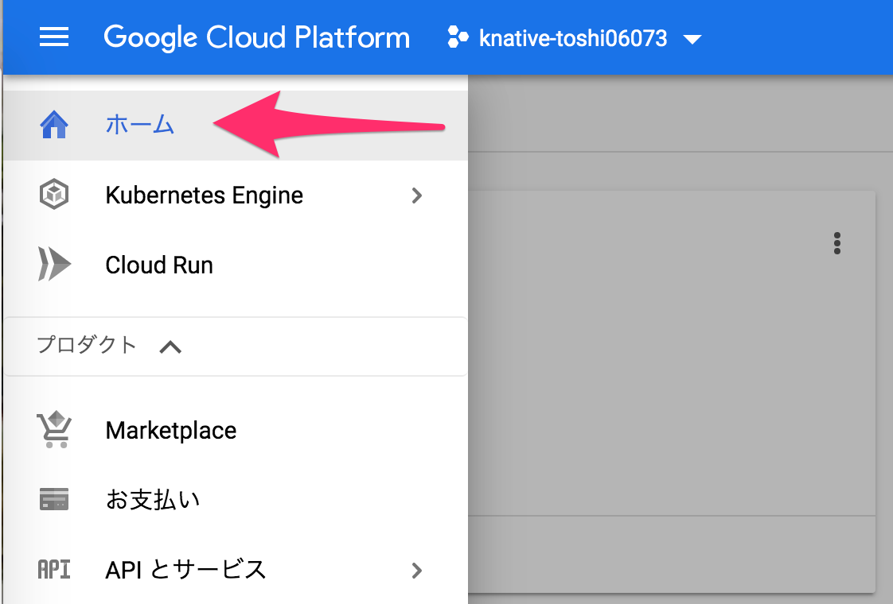
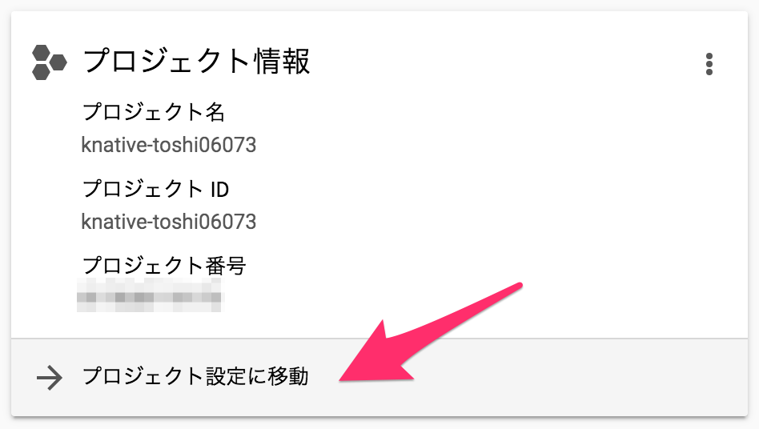
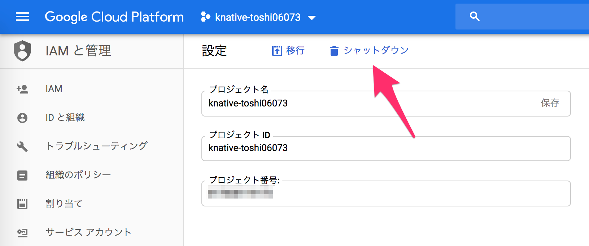
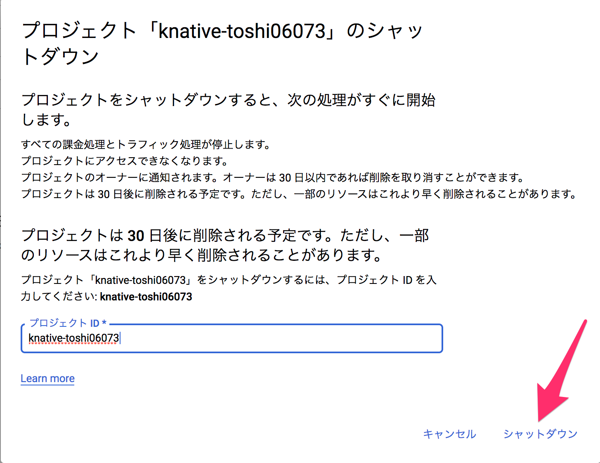

## 後片付け

### GCPプロジェクトを削除できる場合

ワークショップが終了したらGCPプロジェクトごとシャットダウンしてしまうのが無難です。

*ナビゲーションメニュー*で*ホーム*をクリックしてください。



*プロジェクト情報*の*プロジェクト設定に移動*をクリックしてください。



*シャットダウン*をクリックしてください。



*プロジェクトID*を入力し、シャットダウンをクリックしてください。



クリックするとプロジェクトは選択できなくなると同時に課金はされなくなり、30日後に削除されます。

### GCPプロジェクトを削除できない場合

不要なリソースは削除をオススメします。つぎのコマンドを実行すると削除できます。

```shell
# GKEのクラスタ
$ gcloud container clusters delete $CLUSTER_NAME

# Pub/Sub topic
$ gcloud pubsub topics delete $TOPIC_NAME

# GCR
# $ gcloud container images list
# $ gcloud container images list-tags
# でイメージを探して個別にgcloud container images deleteするか
# GUIでがんばる
```

## 参考

* [Knative公式ドキュメント](https://knative.dev/)
  * [サンプル](https://knative.dev/docs/samples/)
* [Tekton公式ドキュメント](https://github.com/tektoncd/pipeline/tree/master/docs)
* Knativeの実装とKubernetesとの関係を知りたい
  * [Knativeソースコードリーディング入門　Knativeで学ぶKubernetesのカスタムリソースとカスタムコントローラー](https://booth.pm/ja/items/1568456)
* 俺の本を読んでくれ！！！
  * [Knativeの歩き方 KubernetesからServerlessを訪ねて 第2版](https://booth.pm/ja/items/1309468)
* Knative Tutorial
  * https://github.com/meteatamel/knative-tutorial
* Kanative Eventingベースのプロダクト
  * [EveryBridge](https://triggermesh.com/serverless_management_platform/everybridge/)

[戻る](step4.md) | [トップへ](README.md)
